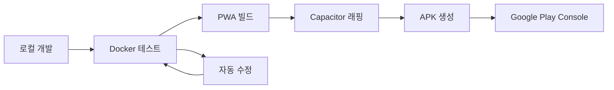

# 90. Sweet Puzzle 개발 환경 구축 - 구글 플레이 스토어 런칭 대응

## 📋 개요

Sweet Puzzle 캔디 크러시 스타일 모바일 퍼즐 게임을 구글 플레이 스토어에 성공적으로 런칭하기 위한 종합적인 개발 환경 구축 가이드입니다.

### 🎯 구글 플레이 스토어 런칭 목표
- **플랫폼 타겟**: Android 앱 (API 21+ 지원)
- **배포 방식**: PWA (Progressive Web App) → 안드로이드 앱 패키징
- **기술 스택**: HTML5/JavaScript → Cordova/Capacitor → APK
- **품질 기준**: Google Play Console 정책 완전 준수

### 🤔 Docker 테스트 vs 구글 스토어 런칭 호환성

**Q: 도커로 테스트하면, 나중에 구글스토어에 런칭하는데 문제는 없습니까?**

**A: 전혀 문제없습니다. 오히려 권장되는 방식입니다.**

#### ✅ Docker 테스트의 장점
```
개발 단계        │ Docker 역할           │ 스토어 런칭과의 관계
─────────────────┼─────────────────────┼─────────────────────────
웹 게임 개발     │ 브라우저 테스트       │ → 웹뷰 기반 앱과 동일
자동화 테스트    │ Playwright 실행       │ → QA 품질 보증
API 통합 테스트  │ 백엔드 서비스 검증    │ → 프로덕션 API 호환성
성능 측정        │ 메모리/CPU 모니터링   │ → 모바일 최적화 검증
CI/CD 파이프라인 │ 자동 빌드/배포        │ → 스토어 업로드 자동화
```

#### 🔄 개발-배포 플로우


## 🛠️ 개발 환경 아키텍처

### 1. 멀티 스테이지 개발 환경

#### 1.1 로컬 개발 환경
```bash
# 기본 웹 개발
docs02/app/dev-environment/
├── package.json                # Node.js 의존성
├── server.js                  # Express 개발 서버
├── webpack.config.js          # 번들링 설정
└── src/                       # HTML5 게임 소스
    ├── index.html
    ├── css/game.css
    └── js/game-engine.js
```

#### 1.2 Docker 테스트 환경
```yaml
# docker-compose.yml
version: '3.8'
services:
  sweet-puzzle-dev:
    build: .
    ports:
      - "3000:3000"      # 게임 서버
      - "8080:8080"      # 개발 도구
    volumes:
      - ./src:/app/src
      - ./test-setup:/app/tests
    environment:
      - NODE_ENV=development
      - MOBILE_TESTING=true      # 모바일 시뮬레이션 모드
```

#### 1.3 모바일 앱 빌드 환경
```bash
# 안드로이드 앱 패키징 환경
mobile-build/
├── capacitor.config.ts        # Capacitor 설정
├── android/                   # 안드로이드 프로젝트
│   ├── app/build.gradle      # APK 빌드 설정
│   └── app/src/main/
├── ios/                       # iOS 프로젝트 (선택사항)
└── dist/                      # PWA 빌드 결과물
```

### 2. 구글 플레이 스토어 요구사항 대응

#### 2.1 기술적 요구사항
```javascript
// capacitor.config.ts
export default {
  appId: 'com.sweetpuzzle.game',
  appName: 'Sweet Puzzle',
  webDir: 'dist',
  bundledWebRuntime: false,
  
  // Google Play Store 필수 설정
  android: {
    minSdkVersion: 21,           // Android 5.0+
    targetSdkVersion: 34,        // 최신 API 레벨
    compileSdkVersion: 34,
    
    // 보안 정책
    usesCleartextTraffic: false,
    allowBackup: false,
    
    // 성능 최적화
    useLegacyPackaging: false,
    enableProguard: true
  },
  
  // PWA 설정
  plugins: {
    SplashScreen: {
      launchShowDuration: 2000,
      backgroundColor: "#FF6B6B"
    },
    StatusBar: {
      style: "dark",
      backgroundColor: "#FF6B6B"
    }
  }
};
```

#### 2.2 매니페스트 파일 (PWA → 앱 변환)
```json
// src/manifest.json
{
  "name": "Sweet Puzzle - 캔디 크러시 스타일 퍼즐",
  "short_name": "Sweet Puzzle",
  "version": "1.0.0",
  "description": "재미있는 3매치 퍼즐 게임",
  
  "icons": [
    {
      "src": "assets/icon-192.png",
      "sizes": "192x192",
      "type": "image/png",
      "purpose": "any maskable"
    },
    {
      "src": "assets/icon-512.png",
      "sizes": "512x512",
      "type": "image/png"
    }
  ],
  
  "start_url": "/",
  "display": "standalone",
  "orientation": "portrait",
  "theme_color": "#FF6B6B",
  "background_color": "#FFFFFF",
  
  // Google Play Store 필수
  "categories": ["games", "puzzle"],
  "scope": "/",
  "lang": "ko-KR"
}
```

## 🚀 구글 플레이 스토어 런칭 프로세스

### 1. 개발 → 배포 파이프라인

#### 1.1 자동화된 빌드 프로세스
```bash
#!/bin/bash
# build-for-playstore.sh

echo "🍭 Sweet Puzzle 구글 플레이 스토어 빌드 시작..."

# 1. Docker 환경에서 최종 테스트
echo "📋 Docker 환경 최종 테스트..."
docker-compose -f docker-compose.prod.yml up --build -d
npm run test:e2e:mobile

# 2. PWA 최적화 빌드
echo "🔧 PWA 최적화 빌드..."
npm run build:pwa
npm run optimize:assets

# 3. Capacitor로 안드로이드 앱 래핑
echo "📱 안드로이드 앱 생성..."
npx cap add android
npx cap copy android
npx cap sync android

# 4. APK/AAB 빌드
echo "📦 APK 빌드..."
cd android
./gradlew assembleRelease
./gradlew bundleRelease  # Google Play용 AAB

# 5. Google Play Console 업로드 준비
echo "🚀 업로드 준비 완료"
echo "APK: android/app/build/outputs/apk/release/app-release.apk"
echo "AAB: android/app/build/outputs/bundle/release/app-release.aab"
```

#### 1.2 Google Play Console 설정
```javascript
// Google Play Console 필수 정보
const playStoreConfig = {
  // 앱 정보
  title: "Sweet Puzzle",
  shortDescription: "재미있는 3매치 퍼즐 게임",
  fullDescription: `
    🍭 Sweet Puzzle은 캔디 크러시 스타일의 중독성 있는 퍼즐 게임입니다!
    
    ✨ 주요 기능:
    • 500+ 도전적인 레벨
    • 다양한 특수 블록과 파워업
    • 친구들과 점수 경쟁
    • 일일 보상과 이벤트
    
    🎯 게임 방법:
    같은 색 캔디 3개 이상을 연결하여 제거하세요!
    레벨 목표를 달성하고 별 3개를 획득하세요!
  `,
  
  // 분류 및 태그
  category: "GAME_PUZZLE",
  contentRating: "EVERYONE",
  tags: ["퍼즐", "캔디", "매치3", "캐주얼"],
  
  // 권한 설명
  permissions: {
    "INTERNET": "온라인 순위표 및 친구 기능",
    "ACCESS_NETWORK_STATE": "네트워크 연결 상태 확인",
    "VIBRATE": "게임 피드백 효과"
  }
};
```

### 2. 품질 보증 체크리스트

#### 2.1 Google Play Store 정책 준수
```bash
# 자동 품질 검사 스크립트
#!/bin/bash
# quality-check-playstore.sh

echo "📋 Google Play Store 품질 검사..."

# 성능 테스트
echo "⚡ 성능 테스트..."
npm run test:performance
# 목표: 첫 로딩 3초 이내, 60FPS 유지

# 보안 검사
echo "🔒 보안 검사..."
npm run audit:security
# APK 서명, 난독화, 보안 통신 확인

# 접근성 테스트
echo "♿ 접근성 테스트..."
npm run test:accessibility
# 시각/청각 장애인 지원 기능

# 다국어 지원 검증
echo "🌍 다국어 지원 검증..."
npm run test:i18n
# 한국어, 영어 기본 지원

# 다양한 화면 크기 테스트
echo "📱 반응형 테스트..."
npm run test:responsive
# 4인치 ~ 12인치 태블릿까지

echo "✅ 품질 검사 완료 - Google Play Store 준비됨"
```

#### 2.2 사용자 경험 최적화
```javascript
// UX 최적화 설정
const mobileOptimization = {
  // 터치 최적화
  touchTargetSize: "44px",  // 최소 터치 영역
  touchResponse: "< 100ms", // 터치 반응 시간
  
  // 성능 최적화
  initialLoadTime: "< 3s",   // 첫 로딩 시간
  frameRate: "60fps",        // 프레임률 유지
  memoryUsage: "< 100MB",    // 메모리 사용량
  
  // 네트워크 최적화
  offlineSupport: true,      // 오프라인 플레이
  dataSaving: true,          // 데이터 절약 모드
  
  // 배터리 최적화
  backgroundMode: false,     // 백그라운드 실행 제한
  optimizedRendering: true   // 렌더링 최적화
};
```

## 🔧 Docker 기반 모바일 테스트 환경

### 1. 모바일 시뮬레이션 Docker 설정

#### 1.1 Android 에뮬레이터 통합
```dockerfile
# Dockerfile.mobile-test
FROM node:18-alpine

# Android SDK 설치 (테스트용)
RUN apk add --no-cache openjdk11-jdk wget unzip

# Chrome/Firefox 모바일 시뮬레이션
RUN npm install -g @playwright/test
RUN npx playwright install chromium firefox

# 모바일 테스트 환경 설정
ENV MOBILE_TEST_MODE=true
ENV DEVICE_VIEWPORT="375x667"  # iPhone 크기
ENV USER_AGENT="Mobile Safari"

WORKDIR /app
COPY package*.json ./
RUN npm ci

# 모바일 최적화 테스트 스크립트
COPY mobile-test-suite.js ./
COPY . .

EXPOSE 3000 8080

CMD ["npm", "run", "test:mobile"]
```

#### 1.2 모바일 특화 테스트 시나리오
```javascript
// mobile-test-suite.js
const { test, expect, devices } = require('@playwright/test');

// 다양한 모바일 기기 테스트
const mobileDevices = [
  devices['iPhone 12'],
  devices['Pixel 5'],
  devices['Galaxy S21'],
  devices['iPad Mini']
];

mobileDevices.forEach(device => {
  test.describe(`Sweet Puzzle - ${device.name}`, () => {
    test.use({ ...device });
    
    test('게임 로딩 및 터치 입력 테스트', async ({ page }) => {
      await page.goto('/');
      
      // 로딩 시간 측정
      const startTime = Date.now();
      await page.waitForSelector('.game-board');
      const loadTime = Date.now() - startTime;
      
      expect(loadTime).toBeLessThan(3000); // 3초 이내 로딩
      
      // 터치 입력 테스트
      const candy = page.locator('.candy').first();
      await candy.tap();
      
      // 터치 반응 확인
      await expect(candy).toHaveClass(/selected/);
    });
    
    test('세로 모드 게임 플레이', async ({ page }) => {
      await page.setViewportSize({ width: 375, height: 812 });
      await page.goto('/');
      
      // 세로 모드 UI 확인
      const gameBoard = page.locator('.game-board');
      await expect(gameBoard).toBeVisible();
      
      // 게임 보드가 화면에 맞게 조정되는지 확인
      const boardSize = await gameBoard.boundingBox();
      expect(boardSize.width).toBeLessThanOrEqual(375);
    });
  });
});
```

### 2. CI/CD 파이프라인 - GitHub Actions

#### 2.1 자동화된 테스트 및 빌드
```yaml
# .github/workflows/sweet-puzzle-ci.yml
name: Sweet Puzzle CI/CD

on:
  push:
    branches: [ main ]
  pull_request:
    branches: [ main ]

jobs:
  test:
    runs-on: ubuntu-latest
    
    steps:
    - uses: actions/checkout@v3
    
    - name: Setup Node.js
      uses: actions/setup-node@v3
      with:
        node-version: '18'
        
    - name: Install dependencies
      run: npm ci
      working-directory: docs02/app
      
    - name: Run Docker tests
      run: |
        docker-compose up -d
        npm run test:e2e
        docker-compose down
      working-directory: docs02/app
      
    - name: Upload test results
      uses: actions/upload-artifact@v3
      with:
        name: test-results
        path: docs02/app/test-results/

  build-android:
    needs: test
    runs-on: ubuntu-latest
    
    steps:
    - uses: actions/checkout@v3
    
    - name: Setup Java
      uses: actions/setup-java@v3
      with:
        distribution: 'adopt'
        java-version: '11'
        
    - name: Build PWA
      run: |
        npm ci
        npm run build:pwa
      working-directory: docs02/app
      
    - name: Build Android APK
      run: |
        npx cap add android
        npx cap copy android
        npx cap sync android
        cd android && ./gradlew assembleRelease
      working-directory: docs02/app
      
    - name: Upload APK
      uses: actions/upload-artifact@v3
      with:
        name: android-apk
        path: docs02/app/android/app/build/outputs/apk/release/
```

## 📱 모바일 최적화 전략

### 1. 성능 최적화

#### 1.1 리소스 최적화
```javascript
// webpack.config.js - 모바일 최적화
module.exports = {
  mode: 'production',
  
  optimization: {
    splitChunks: {
      chunks: 'all',
      cacheGroups: {
        vendor: {
          test: /[\\/]node_modules[\\/]/,
          name: 'vendors',
          chunks: 'all',
        },
        game: {
          test: /src[\\/]js[\\/]game/,
          name: 'game-engine',
          chunks: 'all',
        }
      }
    },
    
    // 모바일용 최적화
    usedExports: true,
    sideEffects: false,
    minimize: true
  },
  
  // 이미지 최적화
  module: {
    rules: [
      {
        test: /\.(png|jpg|gif)$/,
        use: [
          {
            loader: 'image-webpack-loader',
            options: {
              mozjpeg: { quality: 80 },
              pngquant: { quality: [0.6, 0.8] },
              webp: { quality: 80 }
            }
          }
        ]
      }
    ]
  }
};
```

#### 1.2 메모리 관리
```javascript
// 모바일 메모리 최적화
class MobileGameEngine {
  constructor() {
    this.maxCandies = 64;  // 8x8 보드 제한
    this.texturePool = new Map();  // 텍스처 재사용
    this.animationQueue = [];  // 애니메이션 큐 관리
    
    // 메모리 경고 감지
    if ('memory' in performance) {
      this.monitorMemory();
    }
  }
  
  monitorMemory() {
    setInterval(() => {
      const memInfo = performance.memory;
      const usedMB = memInfo.usedJSHeapSize / 1048576;
      
      if (usedMB > 80) {  // 80MB 초과 시
        this.cleanupMemory();
      }
    }, 5000);
  }
  
  cleanupMemory() {
    // 사용하지 않는 텍스처 해제
    this.texturePool.clear();
    
    // 완료된 애니메이션 정리
    this.animationQueue = this.animationQueue.filter(anim => !anim.completed);
    
    // 가비지 컬렉션 힌트
    if (window.gc) window.gc();
  }
}
```

### 2. 사용자 경험 최적화

#### 2.1 Progressive Loading
```javascript
// 점진적 로딩 시스템
class ProgressiveLoader {
  constructor() {
    this.criticalResources = [
      'css/game.css',
      'js/game-engine.js',
      'images/candy-sprites.png'
    ];
    
    this.nonCriticalResources = [
      'audio/background-music.mp3',
      'images/particle-effects.png',
      'js/analytics.js'
    ];
  }
  
  async loadGame() {
    // 1단계: 핵심 리소스 로딩
    this.showLoadingScreen();
    await this.loadCriticalResources();
    
    // 2단계: 게임 시작 가능
    this.hideLoadingScreen();
    this.enableGameStart();
    
    // 3단계: 백그라운드에서 추가 리소스 로딩
    this.loadNonCriticalResources();
  }
  
  showLoadingScreen() {
    const loader = document.createElement('div');
    loader.id = 'game-loader';
    loader.innerHTML = `
      <div class="loading-spinner">🍭</div>
      <p>Sweet Puzzle 로딩 중...</p>
      <div class="progress-bar">
        <div class="progress" id="load-progress"></div>
      </div>
    `;
    document.body.appendChild(loader);
  }
}
```

## 🎯 구글 플레이 스토어 성공 전략

### 1. ASO (App Store Optimization)

#### 1.1 키워드 최적화
```javascript
// ASO 키워드 전략
const asoStrategy = {
  primaryKeywords: [
    "퍼즐 게임",
    "캔디 크러시",
    "매치 3",
    "사탕 게임"
  ],
  
  secondaryKeywords: [
    "무료 퍼즐",
    "두뇌 게임",
    "캐주얼 게임",
    "중독성 게임"
  ],
  
  longTailKeywords: [
    "캔디 크러시 같은 게임",
    "재미있는 퍼즐 게임",
    "무료 사탕 매치 게임"
  ]
};
```

#### 1.2 스크린샷 및 앱 미리보기
```javascript
// 스크린샷 최적화 가이드
const screenshotPlan = {
  image1: {
    title: "🍭 중독성 있는 퍼즐 게임플레이",
    description: "3매치 게임의 재미를 경험하세요",
    deviceType: "phone"
  },
  
  image2: {
    title: "✨ 다양한 특수 블록과 파워업",
    description: "폭탄, 레인보우 등 강력한 아이템",
    deviceType: "phone"
  },
  
  image3: {
    title: "🏆 친구들과 점수 경쟁",
    description: "리더보드에서 1등을 차지하세요",
    deviceType: "tablet"
  },
  
  image4: {
    title: "🌟 500+ 도전적인 레벨",
    description: "끝없는 재미가 기다립니다",
    deviceType: "phone"
  }
};
```

### 2. 사용자 획득 및 리텐션

#### 2.1 초기 사용자 경험 최적화
```javascript
// 온보딩 최적화
class OnboardingManager {
  constructor() {
    this.tutorialSteps = [
      { type: 'highlight', target: '.candy', message: '같은 색 캔디를 터치하세요' },
      { type: 'gesture', action: 'swipe', message: '드래그해서 캔디를 움직이세요' },
      { type: 'celebration', message: '훌륭해요! 첫 매치 성공!' },
      { type: 'powerup', message: '특수 블록으로 더 많은 점수를!' }
    ];
  }
  
  async startTutorial() {
    for (const step of this.tutorialSteps) {
      await this.showTutorialStep(step);
      await this.waitForUserAction();
    }
    
    // 튜토리얼 완료 보상
    this.giveNewPlayerBonus();
  }
}
```

#### 2.2 데이터 기반 개선
```javascript
// 분석 및 최적화
class GameAnalytics {
  trackUserJourney() {
    // 핵심 지표 추적
    this.track('game_start');
    this.track('tutorial_complete');
    this.track('level_complete', { level: 1, time: 45, moves: 12 });
    this.track('power_up_used', { type: 'bomb', level: 3 });
    this.track('retention_day_1');
    this.track('retention_day_7');
  }
  
  optimizeBasedOnData() {
    // A/B 테스트
    if (this.getVariant() === 'easier_tutorial') {
      this.reduceTutorialDifficulty();
    }
    
    // 동적 난이도 조정
    if (this.getUserFailureRate() > 0.7) {
      this.adjustLevelDifficulty(-1);
    }
  }
}
```

## 🔒 보안 및 규정 준수

### 1. Google Play Store 정책 준수

#### 1.1 데이터 프라이버시
```javascript
// GDPR/개인정보보호 준수
class PrivacyManager {
  constructor() {
    this.userConsent = false;
    this.dataCollection = {
      gameplay: false,
      analytics: false,
      advertising: false
    };
  }
  
  async requestUserConsent() {
    const consent = await this.showConsentDialog();
    
    if (consent.analytics) {
      this.enableAnalytics();
    }
    
    if (consent.personalization) {
      this.enablePersonalization();
    }
    
    // 동의 내역 저장 (암호화)
    this.saveConsentSettings(consent);
  }
  
  showConsentDialog() {
    return new Promise(resolve => {
      const dialog = document.createElement('div');
      dialog.innerHTML = `
        <div class="privacy-dialog">
          <h3>개인정보 이용 동의</h3>
          <p>Sweet Puzzle은 게임 개선을 위해 다음 정보를 수집합니다:</p>
          
          <label>
            <input type="checkbox" id="analytics-consent">
            게임 플레이 분석 (선택)
          </label>
          
          <label>
            <input type="checkbox" id="ads-consent">
            맞춤형 광고 (선택)
          </label>
          
          <button onclick="submitConsent()">동의하고 시작</button>
        </div>
      `;
      document.body.appendChild(dialog);
    });
  }
}
```

#### 1.2 결제 시스템 보안
```javascript
// Google Play Billing 통합
class SecureBilling {
  constructor() {
    this.billingClient = null;
    this.skuDetails = [];
  }
  
  async initializeBilling() {
    // Google Play Billing Library 초기화
    this.billingClient = await BillingClient.newBuilder()
      .setListener(this.purchaseUpdateListener)
      .enablePendingPurchases()
      .build();
      
    // 서버 검증을 통한 구매 확인
    await this.connectToPlayBilling();
  }
  
  async purchaseItem(sku) {
    // 클라이언트 측 구매 시작
    const purchase = await this.billingClient.launchBillingFlow(sku);
    
    // 서버 검증 필수
    const verified = await this.verifyPurchaseOnServer(purchase);
    
    if (verified) {
      this.grantPurchasedItem(sku);
    }
  }
}
```

## 🚀 배포 체크리스트

### 최종 Google Play Store 배포 전 확인사항

```bash
# 최종 배포 체크리스트
echo "📋 Google Play Store 배포 최종 점검..."

# ✅ 1. 기술적 요구사항
[ ] Android API 21+ 지원
[ ] 64비트 아키텍처 지원
[ ] Target SDK 34 (Android 14)
[ ] 보안 정책 준수

# ✅ 2. 콘텐츠 정책
[ ] 적절한 연령 등급 (전체 이용가)
[ ] 폭력적/선정적 콘텐츠 없음
[ ] 지적재산권 침해 없음
[ ] 스팸/misleading 요소 없음

# ✅ 3. 사용자 경험
[ ] 앱 크래시 없음 (<0.1% ANR)
[ ] 로딩 시간 3초 이내
[ ] 60FPS 유지
[ ] 다양한 기기 호환성

# ✅ 4. 메타데이터
[ ] 앱 이름/설명 최적화
[ ] 고품질 스크린샷 5장
[ ] 앱 아이콘 적절함
[ ] 개인정보처리방침 링크

# ✅ 5. 테스트
[ ] 내부 테스트 완료
[ ] 알파/베타 테스트 실행
[ ] Docker 환경 최종 검증
[ ] 실제 기기 테스트 완료

echo "🎉 Google Play Store 배포 준비 완료!"
```

**결론: Docker 테스트 환경은 Google Play Store 런칭에 전혀 문제가 되지 않으며, 오히려 품질 보증과 안정적인 배포를 위한 필수 도구입니다.**

## 📚 참고 자료

- [Google Play Console 개발자 가이드](https://developer.android.com/distribute/console)
- [Capacitor 공식 문서](https://capacitorjs.com/docs)
- [PWA to Android App 가이드](https://web.dev/progressive-web-apps/)
- [Google Play Store 정책](https://play.google.com/about/developer-content-policy/)

이 문서를 통해 Sweet Puzzle 게임을 성공적으로 Google Play Store에 런칭할 수 있는 완전한 개발 환경이 구축됩니다.